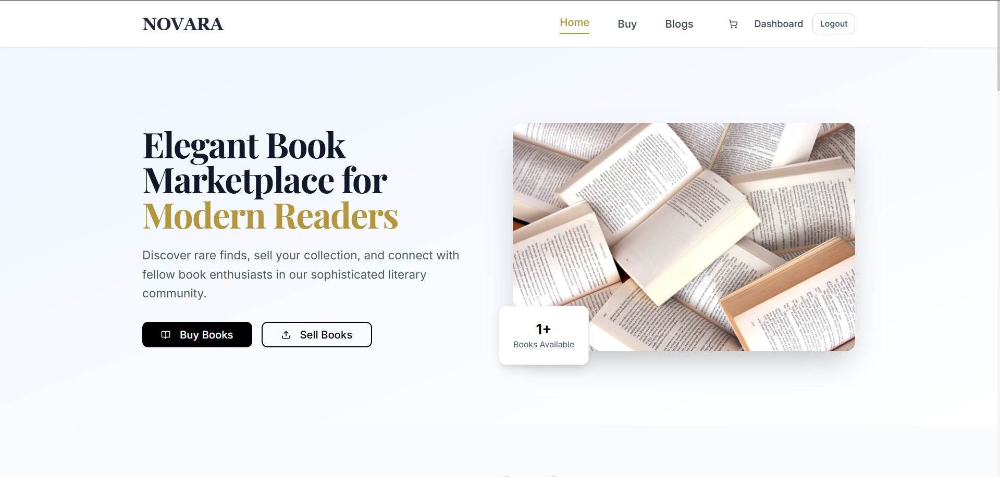
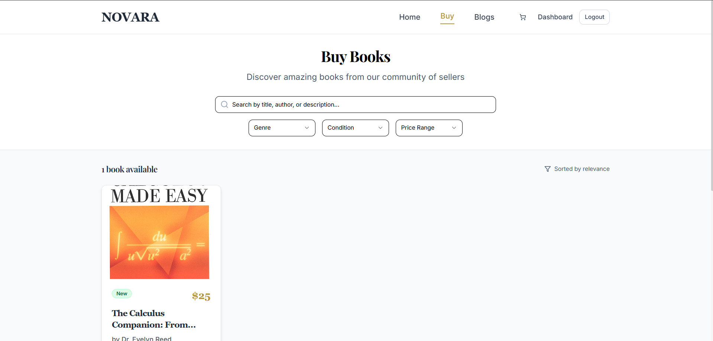
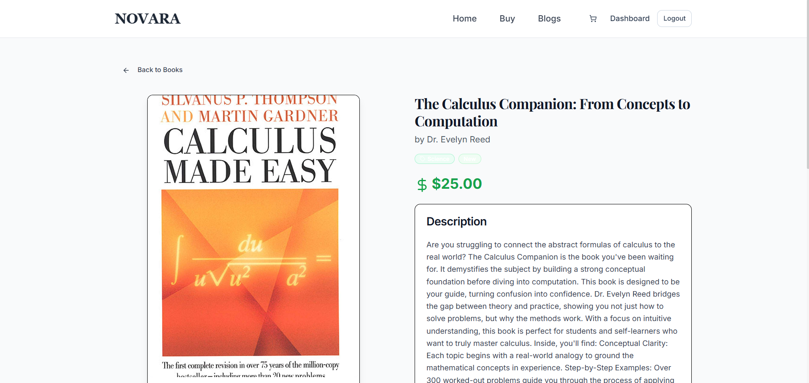
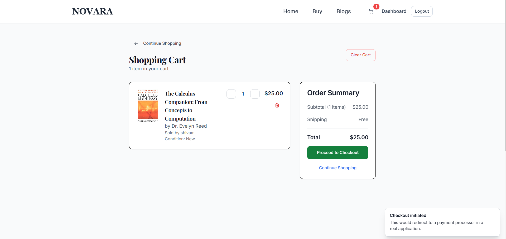
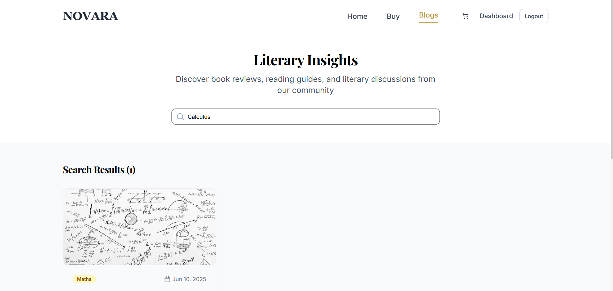
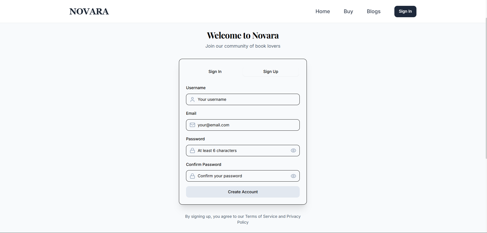
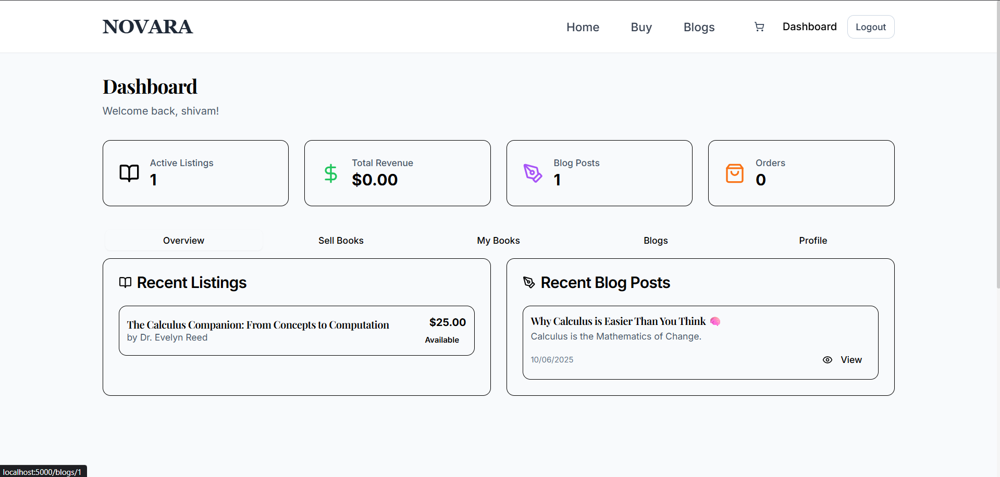
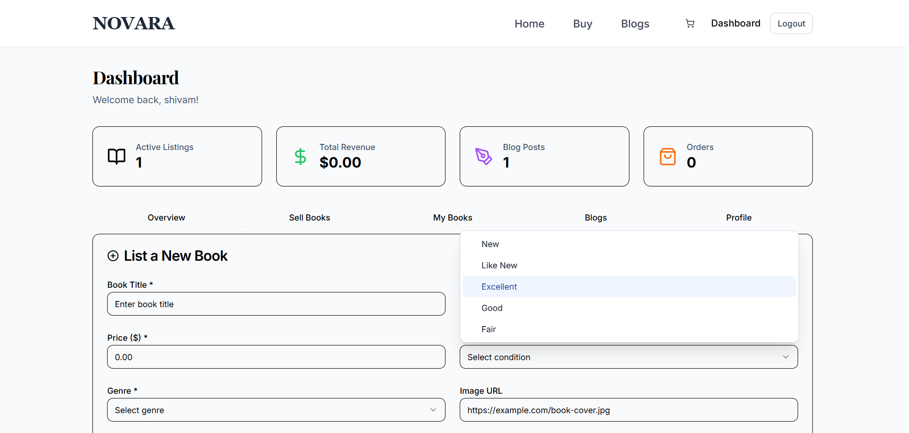
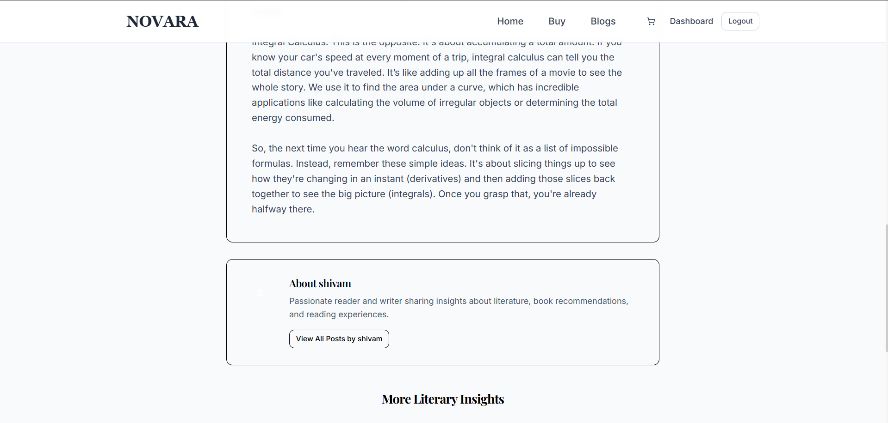

# Novara Bookstore

*A full-stack marketplace born from a journey into React and an unexpected, but welcome, dive into TypeScript.*



---

### The Story Behind Novara

This project marks one of my first significant steps into the world of React, built in June 2024. The plan was simple: build a beautiful, functional online bookstore to solidify my front-end skills. However, a project rarely goes exactly as planned, and that's where the real learning begins.

When setting up the project with Vite, I enthusiastically selected the `React + TypeScript` template. At the time, I was focused on React and didn't fully grasp the new layer of complexity I had just opted into. What started as a simple misclick turned into a foundational learning experience.

Faced with a choice, I decided to embrace the challenge. I began by writing the core logic and components in the JavaScript I was comfortable with, and then, piece by piece, I meticulously translated my work into TypeScript. This process, though challenging, was incredibly rewarding. I leaned heavily on documentation and online resources, and through this "trial-by-fire," I gained a deep appreciation for type safety and the robustness it brings to an application.

Novara Bookstore is the result of that journey. It's more than just a portfolio piece; it's a testament to my commitment to learning, adapting, and seeing a challenge through to completion.

### A Glimpse of Novara

*A quick tour of the application's key features.*

| Buyer's Home Page | Buy Page | Product Details Page | Shopping Cart | Blog Platform |
| :---: | :---: | :---: | :---: | :---: |
|  |  |   |  |  |
| **Registration Page** | **Dashboards Overview** | **Sellers Dashboard** | **Blog Page** | **Blog Page** |
||| |   |  |  |


### Core Features

The platform is a complete marketplace designed for both book lovers and sellers.

**For Buyers:**
* **Intuitive Browsing:** Search and filter through a modern, clean interface.
* **Detailed Views:** Access comprehensive information for every book.
* **Persistent Shopping Cart:** Your selections are saved as you browse.
* **Secure Authentication:** Manage your account and orders safely.

**For Sellers:**
* **Personal Dashboard:** A central hub to manage listings, orders, and sales analytics.
* **Simple Listing Process:** Easily create new book listings with image uploads.
* **Community Engagement:** A built-in blog platform to share content and connect with readers.

### The Technology Stack

This project was built with a modern, type-safe stack from front to back.

| Area         | Technology                               | Purpose                                                                      |
| :----------- | :--------------------------------------- | :--------------------------------------------------------------------------- |
| **Frontend** | React 18, TypeScript, Tailwind CSS       | For a modern, type-safe, and beautifully styled user interface.              |
|              | TanStack Query, Wouter, Radix UI         | For efficient server state management, lightweight routing, and accessible UI components. |
| **Backend** | Express.js, TypeScript                 | For a fast, reliable, and type-safe server environment.                      |
|              | Drizzle ORM, Zod                         | For type-safe database queries and robust schema validation.                 |
| **Tooling** | Vite, ESBuild, PostCSS                   | For a lightning-fast development experience and build process.               |

### Running the Project Locally

Want to see it in action? Follow these simple steps.

**Prerequisites:**
* Node.js (version 18 or higher)
* `npm` or `yarn` package manager

**Installation:**

1.  **Clone the repository:**
    ```bash
    git clone https://github.com/shivamchaubey027/Novara
    cd novara-bookstore
    ```

2.  **Install all the necessary dependencies:**
    ```bash
    npm install
    ```

3.  **Start the development server:**
    ```bash
    npm run dev
    ```

4.  **Open the application:**
    Navigate to `http://localhost:5000` in your web browser.

### Running with Kubernetes

You can also deploy the entire application stack using Kubernetes.

**Prerequisites:**
* A running Kubernetes cluster (e.g., Minikube, Docker Desktop, or MicroK8s).
* `kubectl` command-line tool configured to your cluster.
* A Docker image of the application. The manifests are configured to use `shivamchaubey/novara:v0.1`. You can build your own by running:
  ```bash
  # Make sure your Docker daemon is pointing to your cluster's environment
  # For Minikube: eval $(minikube -p minikube docker-env)
  
  docker build -t shivamchaubey/novara:v0.1 .
  ```
  *(Note: If not using a local cluster, you'll need to push the image to a registry like Docker Hub).*

**Deployment:**

1.  **Clone the repository:**
    ```bash
    git clone https://github.com/shivamchaubey027/Novara
    cd Novara
    ```

2.  **Create the secrets:**
    The `k8s/secrets.yaml` file holds all database credentials. This file is listed in `.gitignore` and should not be committed to version control. You will need to create this file based on the example below.

    **`k8s/secrets.yaml`:**
    ```yaml
    apiVersion: v1
    kind: Secret
    metadata:
      name: novara-db-secret
    type: Opaque
    stringData:
      database-url: "postgresql://<user>:<password>@postgres-service:5432/novara_db"
      postgres-user: "<user>"
      postgres-password: "<password>"
    ```
    Replace `<user>` and `<password>` with your desired credentials, then apply the file:
    ```bash
    kubectl apply -f k8s/secrets.yaml
    ```

3.  **Enable Ingress Controller (One-Time Setup):**
    An Ingress controller is required to manage external access. If you are using Minikube, you can enable the NGINX Ingress Controller with this command:
    ```bash
    minikube addons enable ingress
    ```
    For other clusters like Docker Desktop or MicroK8s, please refer to their documentation for enabling ingress.

4.  **Deploy the Application Stack:**
    Apply the manifests to create the database, application, services, and the ingress route.
    ```bash
    kubectl apply -f k8s/postgres.yaml
    kubectl apply -f k8s/app.yaml
    kubectl apply -f k8s/ingress.yaml
    ```
    The application can be accessed through the service IP. 

5.  **Map `novara.local` to your Cluster:**
    Find your cluster's IP address (for Minikube, run `minikube ip`) and add it to your local `hosts` file (`/etc/hosts` on macOS/Linux, `C:\Windows\System32\drivers\etc\hosts` on Windows).
    ```
    # Example entry in your hosts file
    192.168.49.2  novara.local
    ```

6.  **Access the application:**
    Once the pods are running, you can access the Novara bookstore at **http://novara.local** in your browser.

### For the Curious Ones (Technical Deep Dive)

For those who want to look under the hood, here are the project's structural and API details.

<details>
<summary><strong>Project Structure</strong></summary>


novara-bookstore/
├── client/                 # Frontend React application
│   ├── src/
│   │   ├── components/     # Reusable UI components
│   │   ├── pages/          # Page components
│   │   ├── context/        # React context providers
│   │   ├── hooks/          # Custom React hooks
│   │   ├── lib/            # Utility libraries
│   │   └── main.tsx        # Application entry point
├── server/                 # Backend Express server
│   ├── index.ts            # Server entry point
│   ├── routes.ts           # API route definitions
│   ├── storage.ts          # Data storage layer
│   └── vite.ts             # Vite integration
├── shared/                 # Shared TypeScript definitions
│   └── schema.ts           # Database schemas and types
└── package.json            # Project dependencies


</details>

<details>
<summary><strong>API Endpoints</strong></summary>

* **Authentication**: `POST /api/auth/register`, `POST /api/auth/login`, `POST /api/auth/logout`, `GET /api/auth/me`
* **Books**: `GET /api/books`, `GET /api/books/:id`, `POST /api/books`, `PUT /api/books/:id`, `DELETE /api/books/:id`
* **Blogs**: `GET /api/blogs`, `GET /api/blogs/:id`, `POST /api/blogs`, `PUT /api/blogs/:id`, `DELETE /api/blogs/:id`
* **Dashboard**: `GET /api/dashboard/books`, `GET /api/dashboard/blogs`, `GET /api/dashboard/orders`

</details>

---

Thank you for visiting my project. Feel free to explore the code, run it yourself, and reach out with any questions.
